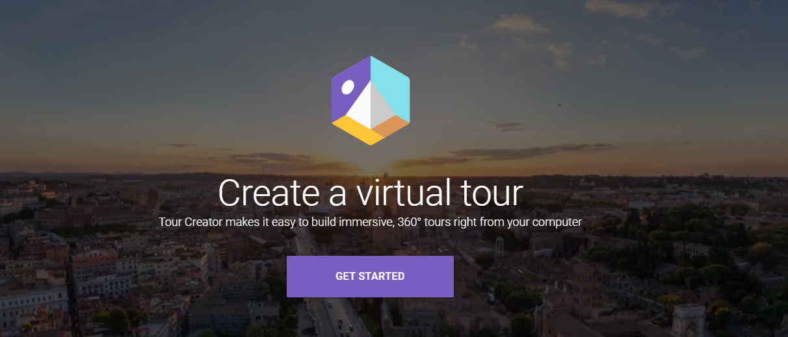
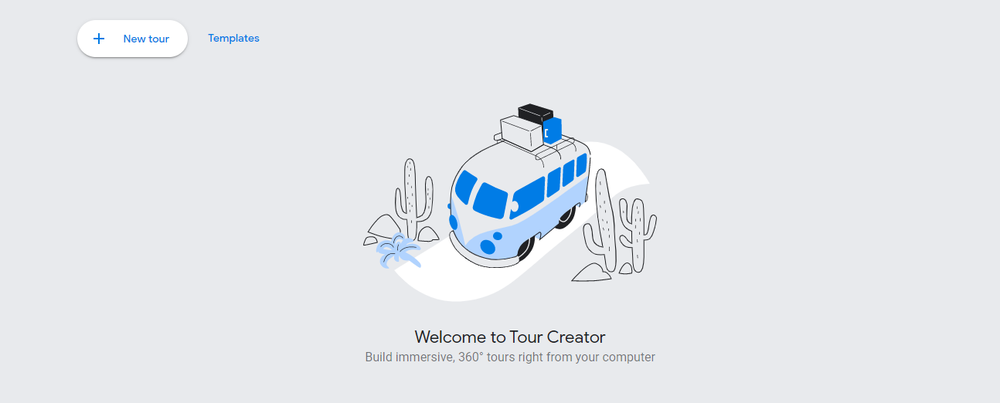
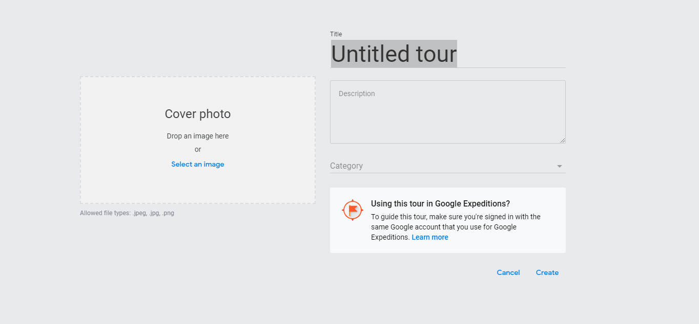

Spesso in tante discipline può risultare interessante creare una sorta di visita guidata virtuale per "agganciare" un argomento alla realtà che circonda gli studenti. Google ci viene in aiuto in questo mettendo a disposizione dei sui utenti un potente strumento per la generazione di percors virtuali che unisce le mappe in modalità street view con la possibilità di aumentare la mappa con POI (*Point of Interest*), punti di interesse che sono contenuti multimediali (test, audio, immagini) che sono "agganciati" ad un punto preciso della mappa stessa.

Ogni tour sarà formato da più scene e per ogni scena potremo aggiungere i punti di interesse che ci interessano. 

Immaginiamo il lavoro di preparazione di una uscita didattica dove si va a proporre agli studenti di realizzare un tuor virtuale, documentandosi e andando a inserire loro i POI relativi ai luoghi che vedranno, arricchendo la mappa con informazioni storiche o di altra natura!

## Primi passi con Google Virtual Tour

Per accedere a Google virtual tour è sufficiente collegarsi all'indirizzo [https://arvr.google.com/tourcreator/](https://arvr.google.com/tourcreator/). Ci verrà mostrata la seguente schermata e per creare un nuovo tour virtuale sarà sufficiente cliccare su *Get Started*

Nella schermata che si apre, sceglieremo *New Tour* in alto a sinistra

### Impostazione di un nuovo tour

Per creare un nuovo tuor dobbiamo assegnare un titolo e una descrizione, eventualmente corredando il nostro tour di una immagine di copertina. Potremo scegliere anche una categoria all'interno della quale inserire il nostro Tour virtuale!

Fatto questo ci si aprirà la schermata dove potremo andare a costruire il nostro tour, ma per questo ti rimando al video di youtube! 

Condividi questo post tra i tuoi colleghi, potrebbe essere interessante!


